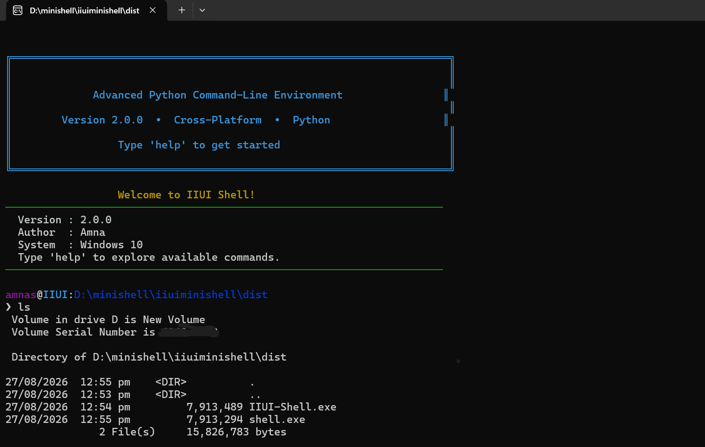

# 🐚 IIUI Mini Shell

**Academic Project — 2024**

### A Lightweight Cross-Platform Shell Built with Python

IIUI Mini Shell is a lightweight command-line shell built from scratch in **Python**, designed to provide essential shell functionality while exploring concepts such as command parsing, process execution, filesystem operations, pipes, I/O redirection, and command history.



## ✨ Features

### 🧩 Built-in Commands

Includes **20+ built-in commands** for everyday shell operations:

| Command           | Description                 |
| ----------------- | --------------------------- |
| `cd`              | Change directory            |
| `pwd`             | Show current directory      |
| `ls` / `dir`      | List files and directories  |
| `mkdir`           | Create directories          |
| `rmdir`           | Remove empty directories    |
| `touch`           | Create files                |
| `rm` / `del`      | Remove files or directories |
| `cat` / `type`    | Display file contents       |
| `echo`            | Print text                  |
| `clear` / `cls`   | Clear terminal              |
| `history`         | View command history        |
| `whoami`          | Display current username    |
| `which` / `where` | Locate commands             |
| `date`            | Display date and time       |
| `tree`            | Display directory structure |
| `help`            | Show command reference      |
| `about`           | Display shell information   |
| `exit` / `quit`   | Exit the shell              |

### 📜 Persistent Command History

* Saves command history between sessions
* Navigate previously entered commands using arrow keys

### ⌨️ Tab Auto-completion

* Auto-complete available commands with `Tab`
* Complete file and directory names

### 🔗 Pipes

Supports piping the output of one command into another:

```bash
command1 | command2
```

### 📥 I/O Redirection

Supports redirecting command input and output:

```bash
command > output.txt
command >> output.txt
command < input.txt
```

### ⚙️ Background Processes

Run commands without blocking the shell:

```bash
command &
```

### 🖥️ Cross-Platform

Designed to work across **Windows, Linux, and macOS**, with platform-specific command aliases such as `dir`/`ls` and `cls`/`clear`.

## 🛠️ Tech Stack

* **Python**
* `subprocess`
* `os`
* `shutil`
* `readline` / platform-specific input handling
* **PyInstaller** for executable packaging

## 🚀 Getting Started

### Clone the repository

```bash
git clone https://github.com/aamnamz/IIUI-Mini-Shell.git
cd IIUI-Mini-Shell
```

### Run the shell

```bash
python main.py
```

## 📦 Standalone Executable

The project can be packaged as a standalone Windows executable using **PyInstaller**, allowing the shell to run without requiring a Python installation.

```bash
pyinstaller --onefile main.py
```

The generated executable will be available in the `dist/` directory.

## 💡 What This Project Explores

IIUI Mini Shell was built to explore how command-line shells work internally, including:

* Command parsing and execution
* Process management
* Filesystem operations
* Inter-process communication
* Pipes and I/O redirection
* Persistent command history
* Cross-platform system interaction

## 📌 Project Status

**Completed — standalone shell with cross-platform functionality and Windows executable support.**

## 👩‍💻 Author

**Amna Mumtaz**

[GitHub](https://github.com/aamnamz) · [LinkedIn](https://www.linkedin.com/in/amnaamumtaz/)
